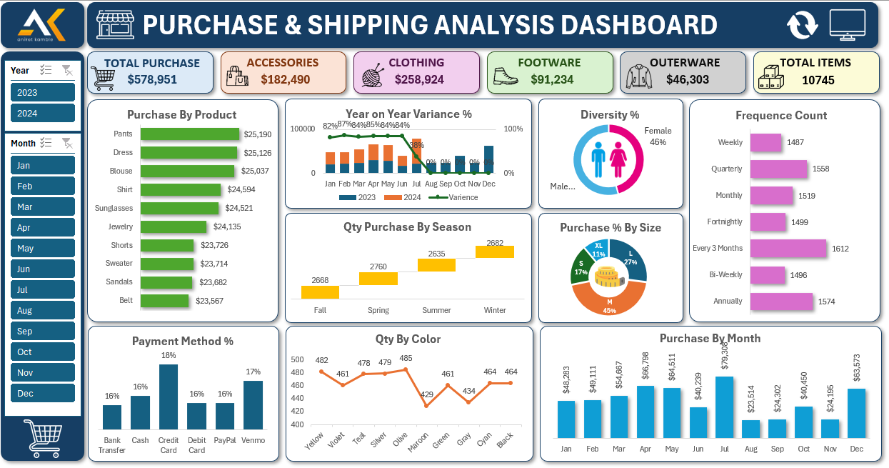

# purchase-shipping-analysis-excel-dashboard
Interactive Purchase &amp; Shipping Analysis Dashboard built using Microsoft Excel to analyze purchasing trends, customer behavior, seasonal demand, payment methods, and monthly sales performance.

# Purchase & Shipping Analysis Dashboard (Excel)

## Project Overview

This project is an interactive Purchase & Shipping Analysis Dashboard developed using Microsoft Excel. The dashboard provides detailed insights into purchasing trends, customer behavior, seasonal demand, payment preferences, and monthly sales performance.

The purpose of this project is to convert raw retail data into meaningful business insights that support better decision-making and business growth.

---

## Dashboard Preview

---

## Key KPIs

* Total Purchase: $578,951
* Total Items: 10,745
* Top Category: Clothing
* Best Performing Month: July
* Highest Demand Size: Medium (M)

---

## Features

* Purchase Analysis by Product
* Year-on-Year Variance Analysis
* Diversity Distribution
* Purchase Frequency Analysis
* Seasonal Purchase Insights
* Size-wise Purchase Distribution
* Payment Method Analysis
* Color Preference Trends
* Monthly Purchase Trends

---

## Tools & Technologies Used

* Microsoft Excel
* Pivot Tables
* Pivot Charts
* Slicers
* Data Cleaning
* Data Visualization
* Excel Dashboard Design

---

## Business Insights

* Clothing category contributes the highest purchase value.
* Medium (M) size products have the highest demand.
* Significant purchase decline observed after July.
* Customers mostly purchase quarterly or every 3 months.
* Seasonal demand remains stable throughout the year.

---

## Files Included

* Excel Dashboard File (.xlsx)
* Dataset File
* Dashboard Screenshot
* README.md

---

## Project Objective

The goal of this dashboard is to help businesses:

* Monitor purchasing trends
* Understand customer behavior
* Improve inventory planning
* Track seasonal demand
* Support data-driven decision-making

---

## Skills Demonstrated

* Data Analysis
* Data Cleaning
* Dashboard Development
* Data Visualization
* Business Intelligence
* Excel Reporting
* Analytical Thinking

---

## Author

Aniket Kamble